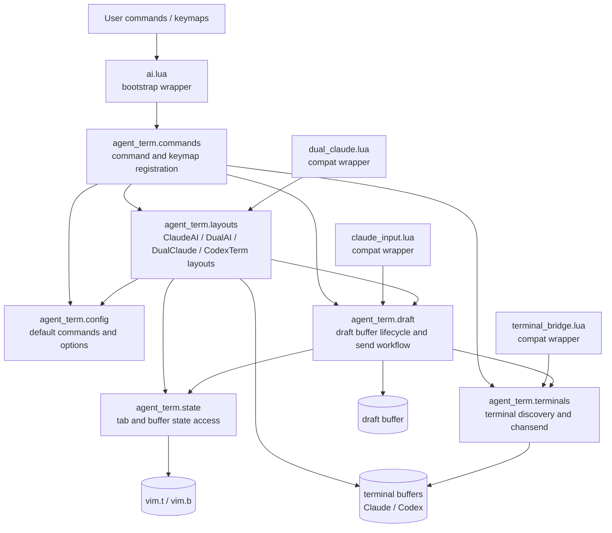

# ADR 0001: Neovim AI Terminal Modules の責務分離

- Status: Proposed
- Date: 2026-05-02

## Context

Neovim の AI terminal 周辺コードは、`ai.lua`、`claude_input.lua`、`terminal_bridge.lua`、`dual_claude.lua` に分散している。
これらは最初から全体設計されたものではなく、Claude Code / Codex / draft buffer / terminal 間送信 / 複数 Claude layout などを必要に応じて追加してきた背景がある。

その結果、現在は user command / keymap、terminal 起動、window layout、draft buffer lifecycle、terminal 探索、`chansend` 送信、`vim.t` / `vim.b` state、external JSON interface が混在している。

## Decision

既存のユーザー向け interface は維持しつつ、内部実装を `agent terminal + draft buffer` の汎用設計へ段階的に分割する。
内部実装は `conf/.config/nvim/lua/agent_term/` 配下に移し、既存ファイルは互換 wrapper として残す。
`agent_term` は terminal 上で動く coding agent と draft buffer の統合を表す namespace とする。

## Architecture

## Responsibility Boundaries

| Module | Responsibility |
| --- | --- |
| `agent_term.config` | agent command、draft height、target pattern、keymap などの既定値 |
| `agent_term.state` | `vim.t` / `vim.b` の読み書き、tab scoped state の唯一の入口 |
| `agent_term.terminals` | terminal buffer の列挙、index / pattern 検索、`chansend`、bracketed paste、external JSON interface |
| `agent_term.draft` | draft buffer の作成、表示、非表示、height 保存復元、clear、send、quote、buffer-local keymap |
| `agent_term.layouts` | `ClaudeAI`、`DualAI`、`DualClaude`、`CodexTerm` の window layout 構築 |
| `agent_term.commands` | user command と global keymap の登録 |
| existing wrapper files | 既存 require path と公開関数名の互換維持 |

## Consequences

- `vim.t` / `vim.b` の直接操作が `agent_term.state` に集約される。
- `terminal_bridge` と `claude_input` の関係が `agent_term.draft -> agent_term.terminals` の一方向になる。
- 既存 command / keymap / Lua API を変えないため、外部から見た整理効果は小さい。
- ファイル数は増えるが、変更時の影響範囲を module boundary で予測しやすくなる。

## Validation

- `stylua` で対象 Lua ファイルを整形する。
- `luac -p` で対象 Lua ファイルの構文確認を通す。
- Neovim headless で draft buffer の作成、resize、hide、reopen、height 復元を確認する。
- 手動で `ClaudeAI`、`DualAI`、`DualClaude`、`TermDraft`、`TermSend` の既存操作が維持されていることを確認する。
